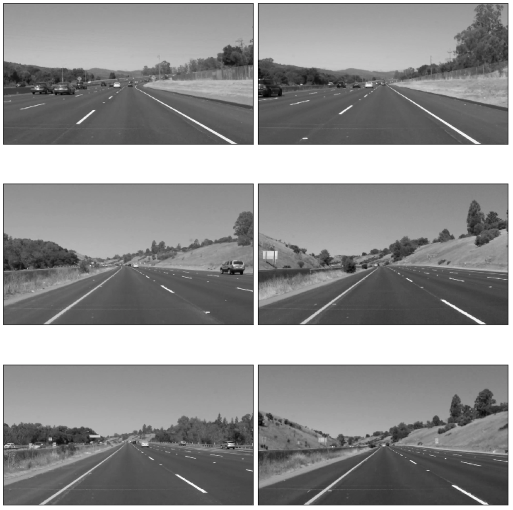

#**Finding Lane Lines on the Road** 
[](http://www.udacity.com/drive)


Overview
---
This is a write-up for the first project of Self-driving car course of Udacity. This will be updated soon.

### Import Package

Basically OpenCV, Numpy and MatplotLib were used in this exercise. OpenCV library was used for grayscale, blur, Canny algorithm, Hough Line algorithm and drawing lines. Numpy library takes a role for calculating the math. And Matplotlib is drawing graphical components.

```python
import os, glob
import matplotlib.pyplot as plt
import matplotlib.image as mpimg
import numpy as np
import cv2
%matplotlib inline
```

### Loading test images

```python
def present_images(images, cmap=None):
    cols = 2
    rows = (len(images)+1)//cols
    
    plt.figure(figsize=(10, 11))
    for i, image in enumerate(images):
        plt.subplot(rows, cols, i+1)
        cmap = 'gray' if len(image.shape) == 2 else cmap
        plt.imshow(image, cmap=cmap)
        plt.xticks([])
        plt.yticks([])
    plt.tight_layout(pad=0, h_pad=0, w_pad=0)
    plt.show()
```


### Converting images to grayscale

The first step of this process is convert color image to grayscale. This will improve output quality of extracting edges from the image.

```python
def transform_image_to_grayscale(img):
    return cv2.cvtColor(img, cv2.COLOR_RGB2GRAY)
```


### Making image smoother

Gaussian smoothing should be added, before running Canny, which is essentially a way of suppressing noise and spurious gradients by averaging. cv2.Canny() actually applies Gaussian smoothing internally, but we include it here because you can get a different result by applying further smoothing.

```python
def blur_image(img, kernel_size=15):
    return cv2.GaussianBlur(img, (kernel_size, kernel_size), 0)

blurred_images = list(map(blur_image, gray_images))
present_images(blurred_images)
```


### Extracting edges from image

The algorithm will first detect strong edge (strong gradient) pixels above the high_threshold, and reject pixels below the low_threshold. Next, pixels with values between the low_threshold and high_threshold will be included as long as they are connected to strong edges. The output edges is a binary image with white pixels tracing out the detected edges and black everywhere else.

```python
def extract_edges_from_image(img, low_threadhold=50, high_threadhold=150):
    return cv2.Canny(img, low_threadhold, high_threadhold)
```


### Adding Mask of Interest Region

To reduce extra unnecessary calculation and to focus only in the place where I'm interesting in, should add mask on the region. 

```python
def add_mask_to_image(img, vertices):
    mask = np.zeros_like(img)
    
    if len(img.shape) > 2:
        channel_count = img.shape[2]
        ignore_mask_color = (255,) * channel_count
    else:
        ignore_mask_color = 255
    
    cv2.fillPoly(mask, vertices, ignore_mask_color)
    
    return cv2.bitwise_and(img, mask)
  
def vertices_for_img(img):
    ysize = img.shape[0]
    xsize = img.shape[1]
    
    left_top = (xsize/2, ysize/2)
    left_bottom = (0,ysize)
    right_top = (xsize/2, ysize/2)
    right_bottom = (xsize,ysize)
    
    return np.array([[left_bottom,left_top,right_top,right_bottom]], dtype=np.int32)
```


### Appling Hough Lines Algorithm

Hough Line algorithm will connect all disconnected lines and dots together.

Let's me explain about the selector of cv2.HoughLinesP method. First off, rho and theta are the distance and angular resolution of my grid in Hough space. Need to specify rho in units of pixels and theta in units of radians. Rho takes a minimum value of 1, and a reasonable starting place for theta is 1 degree (pi/180 in radians). The threshold parameter specifies the minimum number of votes (intersections in a given grid cell) a candidate line needs to have to make it into the output. min_line_length is the minimum length of a line (in pixels) that will accept in the output, and max_line_gap is the maximum distance (again, in pixels) between segments that will be connected into a single line. And it will iterate through output lines and draw them onto the image.


```python
def hough_lines(img):
    return cv2.HoughLinesP(img, rho=1, theta=np.pi/180, threshold=20, minLineLength=20, maxLineGap=300)

def draw_lines(img, lines, color=[255, 0, 0], thickness=2):
    img = np.copy(img)# don't want to change the original image
    
    for line in lines:
        for x1, y1, x2, y2 in line:
            cv2.line(img, (x1,y1), (x2,y2), color, thickness)
    return img
```


### Averaging/Extrapolating Lines
```python
def calculate_average_lane_lines(image, lines):
    left_lane, right_lane = calculate_average_slop_intercept(lines)
    
    y1 = image.shape[0]
    y2 = y1*0.6
    
    left_line = convert_line_into_pixel(y1, y2, left_lane)
    right_line = convert_line_into_pixel(y1, y2, right_lane)
    
    return left_line, right_line

def calculate_average_slop_intercept(lines):
    left_lines = []
    left_weights = []
    right_lines = []
    right_weights = []
    
    for line in lines:
        for x1, y1, x2, y2 in line:
            if x2 == x1:
                continue
                
            slope = (y2-y1)/(x2-x1)
            intercept = y1 - slope*x1
            distance = np.sqrt(((y2-y1)**2) + ((x2-x1)**2))
            
            if slope < 0:
                left_lines.append((slope, intercept))
                left_weights.append(distance)
            else:
                right_lines.append((slope, intercept))
                right_weights.append(distance)

    if len(left_weights) > 0:
        left_lane = np.dot(left_weights, left_lines)/np.sum(left_weights)
    
    if len(right_weights) > 0:
        right_lane = np.dot(right_weights, right_lines)/np.sum(right_weights)
        
    return left_lane, right_lane

def convert_line_into_pixel(y1, y2, line):
    if line is None:
        return None
    
    slope, intercept = line
    
    x1 = int((y1-intercept)/slope)
    x2 = int((y2-intercept)/slope)
    y1 = int(y1)
    y2 = int(y2)
    
    return ((x1, y1), (x2, y2))

def draw_extrapolated_lane_lines(image, lines, color=[255, 0, 0], thickness=15):
    line_image = np.zeros_like(image)
    
    for line in lines:
        if line is None:
            continue
        cv2.line(line_image, *line, color, thickness)

    return cv2.addWeighted(image, 1.0, line_image, 0.95, 0.0)
```


### Lane dectection on Video clips
```python
from moviepy.editor import VideoFileClip
from IPython.display import HTML
```

```python
def process_image(image):
    # NOTE: The output you return should be a color image (3 channel) for processing video below
    # TODO: put your pipeline here,
    # you should return the final output (image where lines are drawn on lanes)
    
    gray_image = transform_image_to_grayscale(image)
    blurred_image = blur_image(gray_image) 
    edge_extracted_image = extract_edges_from_image(blurred_image)
    
    vertices = vertices_for_img(edge_extracted_image)
    masked_edge_image = add_mask_to_image(edge_extracted_image, vertices)

    lines = hough_lines(masked_edge_image)
    line_detected_image = draw_lines(image, lines)
    
    lane_lines = calculate_average_lane_lines(image, lines)
    result = draw_extrapolated_lane_lines(image, lane_lines)
    
    return result
```
### Limitation
Those implementation has limitations. My methodology can detect straight lines only. Currently Hough Line algorithm was used, and extrapolated the output of it. Which returns nice looking results from my test images, which have straight lane lines only. And the way I did might not be a best practice for the situation that has more vehicles are running closely. This pipeline tries to detect lines from the extracted edges of the images. So if most of straight lines were hiden from other objects, it will be failed to returns an appropriate output, so we shouldn't depend only on image processing for detecting street lanes.
